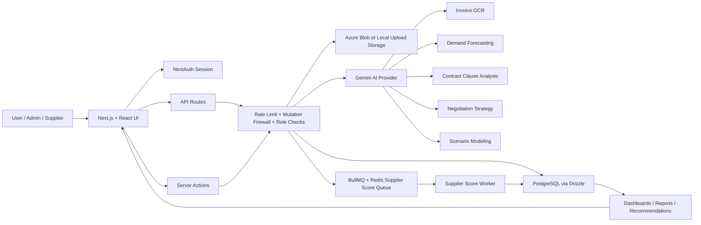
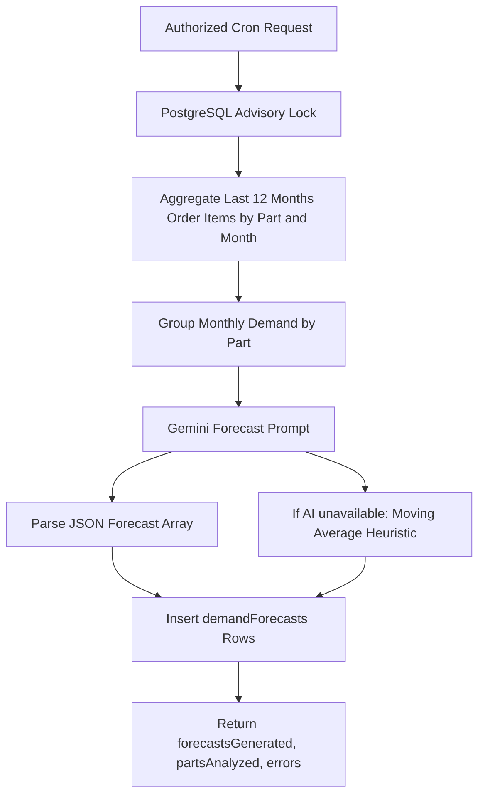
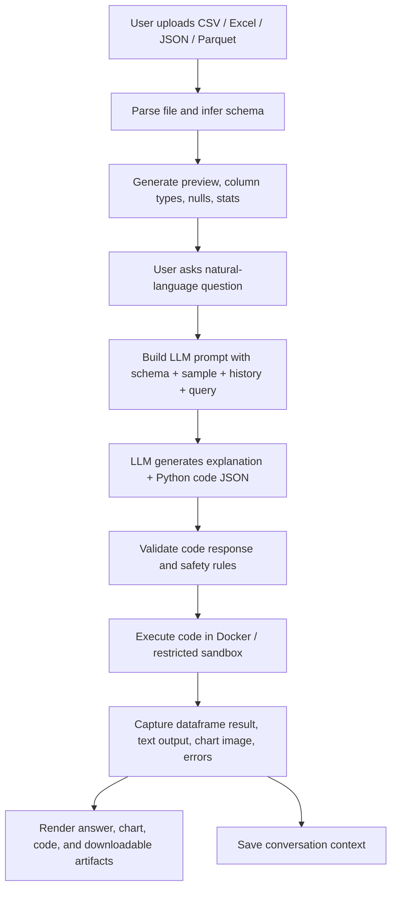
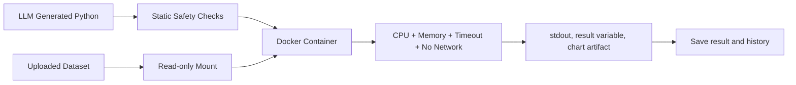
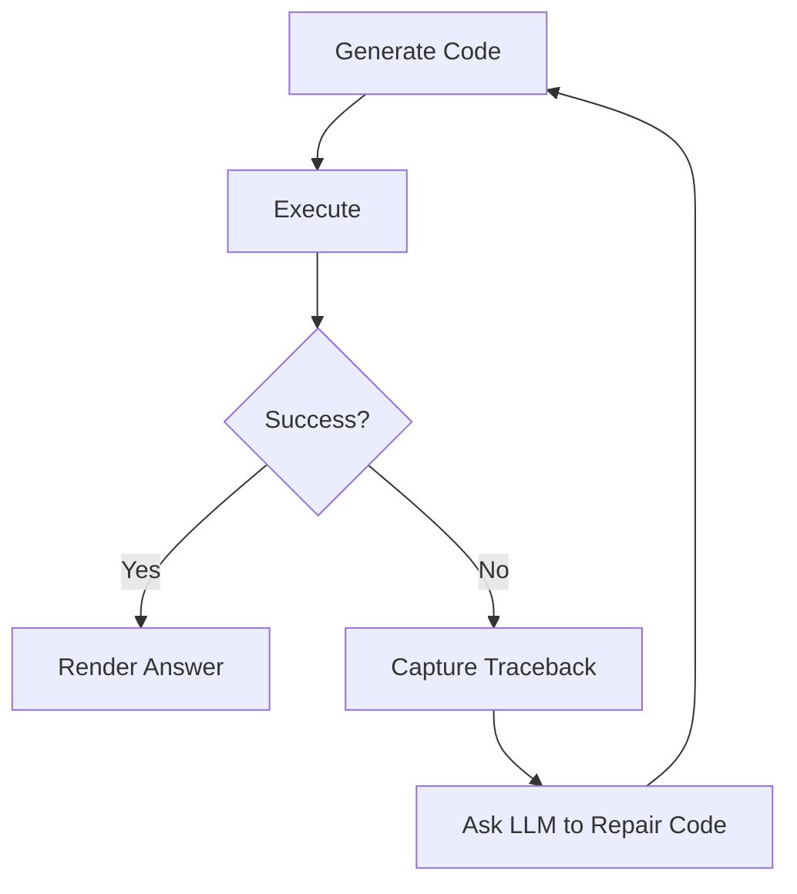
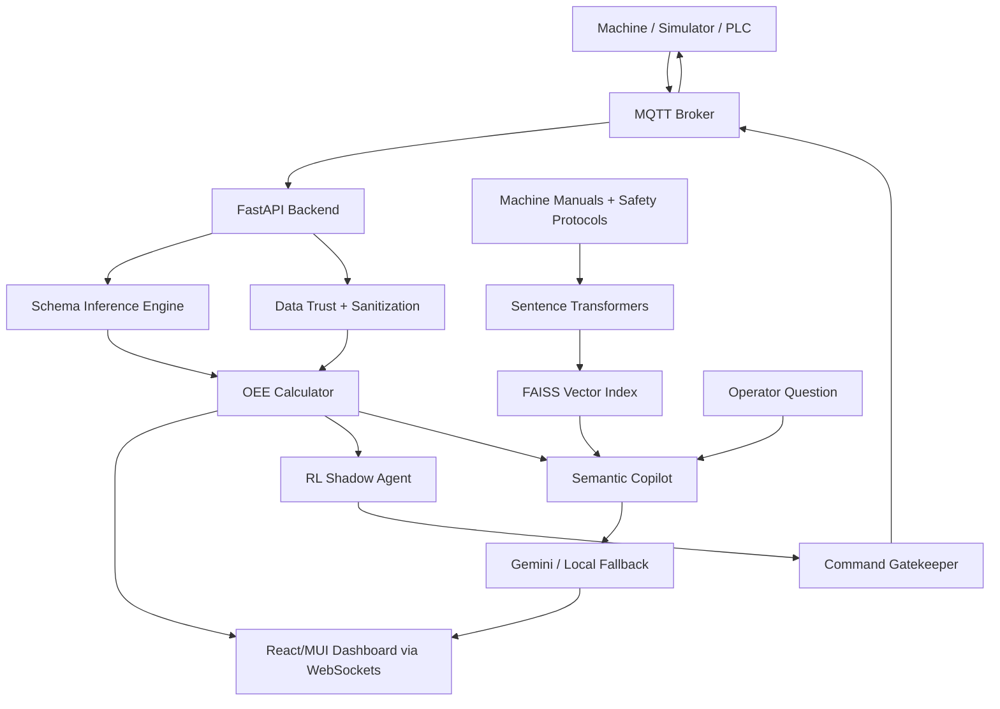
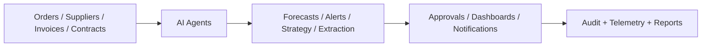
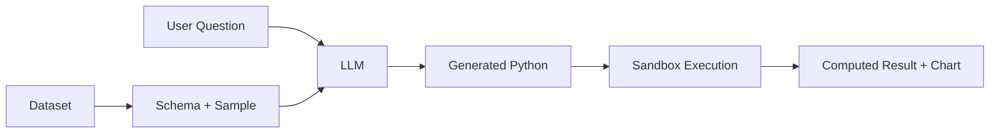
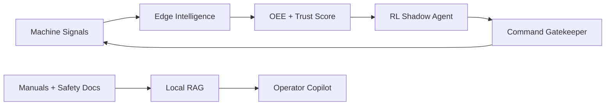

# AI Workshop Full Technical Write-Up

**Focus:** Axiom, Mastiff, and OEE Box  
**Workshop Date:** April 28, 2026  
**Purpose:** A 2+ hour speaking document focused on AI techniques, software architecture, API routes, data flow, and demo storytelling.

---

## How To Use This Write-Up

This document is written as a speaker-ready technical narrative. You can use it in three ways:

1. **As a full talk script:** Follow the sections in order and speak through the flows.
2. **As technical backup:** Use the route maps, AI technique lists, and architecture details during Q&A.
3. **As demo narration:** Before each demo, use the "How the tool works" and "What to say live" blocks.

The main message for the workshop is simple:

> We are not only using AI models. We are building intelligent software systems where models, data, APIs, workflows, security, jobs, storage, and monitoring work together.

That line matters because it separates casual prompting from engineering. The workshop should show that our strength is not just knowing how to call a model. Our strength is knowing how to turn model behavior into reliable product behavior.

---

## Suggested 2+ Hour Speaking Plan

| Time | Section | Goal |
|---:|---|---|
| 0-10 min | Opening framing | Explain AI as a system, not a feature. |
| 10-55 min | Axiom deep dive | Show business AI, routes, agents, OCR, forecasting, security, queues, and integrations. |
| 55-90 min | Mastiff deep dive | Show natural-language data analysis, query-to-code, sandbox execution, charts, exports, and connectors. |
| 90-125 min | OEE Box deep dive | Show edge AI, RAG, telemetry, schema inference, OEE calculation, RL shadow agent, and command safety. |
| 125-145 min | Cross-project AI patterns | Compare techniques across all three projects. |
| 145-160 min | Demo strategy and Q&A | Explain what to demo, what to emphasize, and how to answer technical questions. |

If you need to stretch beyond two hours, spend more time on:

- Axiom agent catalog and API route behavior.
- Mastiff sandboxing and query-to-code security.
- OEE data trust, edge fail-safe design, and RAG explanation.

---

## Executive Framing: What We Are Showcasing

The workshop is not about "we used AI." That is too generic. The workshop should show that we understand different classes of AI systems:

- **Business intelligence AI:** Axiom uses AI and rules to support procurement decisions, supplier risk, demand forecasts, contract review, fraud detection, and workflow automation.
- **Analytical AI:** Mastiff turns uploaded data into conversational analysis by translating natural-language questions into executable Python and visual insights.
- **Edge/industrial AI:** OEE Box brings AI to manufacturing telemetry, using local retrieval, schema inference, OEE metrics, trust scoring, and a safety gate before actions.

The deeper point is that all three projects share the same production mindset:

- Ground the model in data.
- Validate inputs and outputs.
- Keep human approval where risk is high.
- Use fallbacks when AI is unavailable.
- Use routes/APIs to make AI part of real workflows.
- Log, audit, monitor, and test.

---

## Cross-Project AI Capability Map

| Capability | Axiom | Mastiff | OEE Box |
|---|---|---|---|
| LLM reasoning | Gemini-driven OCR, forecasting, contract analysis, negotiation strategy, scenario modeling | LLM translates natural language into Python/SQL/R-style analysis | Gemini Pro answers operator questions using machine context |
| Structured output | JSON extraction for invoice OCR, forecasts, contract risk, negotiation strategy | JSON response with explanation, code, visualization flag | Copilot responses can cite retrieved manuals and telemetry context |
| RAG / retrieval | Knowledge-copilot pattern and document-grounded posture; contract/source evidence | Possible semantic memory with pgvector and data dictionaries | Local FAISS + Sentence Transformers over manuals and safety protocols |
| Forecasting | Demand forecasting from monthly order history; statistical fallback | Time-series forecasting through generated Python/statsmodels/sklearn | Predictive health roadmap with LSTM/GRU and RUL models |
| Anomaly detection | Fraud detection, unusual amounts, duplicate invoices, suspicious patterns | Outlier detection in uploaded datasets | Sensor trust scoring, data sanitization, telemetry anomaly roadmap |
| Agents | Agent registry, dispatcher, bundles, timeouts, approval gating, telemetry | Custom reusable analyst agents for scheduled reports and workflows | RL-inspired shadow agent observes OEE and suggests optimization |
| Code generation | Less central; LLM generates structured recommendations | Core technique: query-to-code generation | Not central; AI reasons over telemetry and manuals |
| Sandbox / safety | Rate limits, mutation firewall, role checks, cron secrets, approval gates | Docker/RestrictedPython sandbox, no internet, resource limits | Command gatekeeper, allow-list, sidecar design, offline fallback |
| Integrations | SAP, Azure Blob, Redis/BullMQ, Postgres, SMTP, webhooks, SSE | Files, databases, SharePoint, Drive, Snowflake, BigQuery, Slack/email | MQTT, Modbus, OPC-UA, WebSockets, local SQLite |

---

# 1. Axiom Deep Dive: Procurement Intelligence Platform

## 1.1 What Axiom Is

Axiom is a procurement intelligence platform for managing suppliers, RFQs, purchase orders, contracts, invoices, spend analytics, supplier risk, and operational workflows.

The important workshop framing:

> Axiom is where we demonstrate full-stack business AI: AI is attached to real procurement objects, real routes, real authentication, real database tables, real jobs, and real operational controls.

In the workshop, position Axiom as the "enterprise AI" example. It shows that AI can sit inside procurement workflows, not as a separate chatbot, but as part of an operational system.

## 1.2 Axiom Technology Stack

**Frontend and product layer**

- Next.js 16 App Router.
- React 19.
- Radix UI components for accessible interaction patterns.
- Recharts for dashboards and data visualization.
- React Hook Form and Zod-driven validation patterns.
- Framer Motion for UI polish.

**Backend and API layer**

- Next.js route handlers under `src/app/api`.
- Server actions under `src/app/actions`.
- NextAuth for user authentication.
- Role-based behavior for admins, users, and suppliers.
- Zod validation for structured request payloads.
- Mutation firewall to block unsafe cross-origin writes.
- Rate limiting for read/write/auth flows.

**Data and infrastructure**

- PostgreSQL with Drizzle ORM.
- Azure Blob Storage for production file uploads.
- Redis and BullMQ for queue-backed background jobs.
- Local fallback behavior when Redis is unavailable.
- Docker/Docker Compose for repeatable deployment.
- Azure App Service or AKS, Azure PostgreSQL, Azure Cache for Redis, and Azure Blob Storage as production targets.

**AI layer**

- Google Generative AI SDK.
- Gemini model access through `getAiModel`, defaulting to `gemini-2.5-flash`.
- API key fallback chain from database settings and environment variables.
- LLM prompts shaped for strict JSON output.
- AI fallbacks where possible, especially in forecasting and contract analysis.

**Ops and reliability**

- Health and readiness routes.
- PostgreSQL advisory locks for cron tasks.
- Telemetry logging for events, metrics, and errors.
- Audit exports for compliance evidence.
- Smoke, unit, and integration tests.

## 1.3 How Axiom Works: Visual Architecture



Talk track:

"Axiom is not a single AI call. It is a complete system. The user interacts through dashboards and forms. API routes authenticate and validate requests. The AI provider is called only after the system has enough context. Results are stored, audited, and surfaced back into workflows. Long-running or repeatable jobs are handled by cron routes or queues."

## 1.4 Axiom Route Map

This is one of the strongest parts to speak confidently about because it proves real software engineering.

| Route | Method | Purpose | AI / Intelligence Angle |
|---|---|---|---|
| `/api/invoices/ocr` | POST | Upload PDF/image invoice and extract structured fields. | Gemini multimodal OCR with JSON schema extraction. |
| `/api/upload` | POST | Upload PDF, image, CSV, Excel, TXT, ZIP files. | Feeds document intelligence and file-backed workflows. |
| `/api/sap` | GET | Report SAP connector configuration and supported actions. | Integration visibility for ERP-connected AI workflows. |
| `/api/sap` | POST | Sync/test/schema for suppliers, parts, invoices. | Maps SAP records to Axiom entities; supports dry-run and commit. |
| `/api/cron/demand-forecast` | GET | Scheduled demand forecast generation. | Gemini forecasting over monthly order demand with moving-average fallback. |
| `/api/cron/commodity-prices` | GET | Updates market price index. | Market intelligence signal; fallback synthetic price generator. |
| `/api/cron/fx-rates` | GET | Fetches and stores exchange rates from ECB. | Currency normalization for spend intelligence. |
| `/api/cron/contracts` | GET | Contract expiry alerts. | Rule-driven operational intelligence and notifications. |
| `/api/cron/webhooks` | GET | Processes pending/retrying webhooks. | Reliable integration delivery with HMAC signatures and retry backoff. |
| `/api/contracts` | GET | List contracts, optionally by supplier. | Contract data source for analysis. |
| `/api/contracts` | POST | Create a contract. | Validated schema for downstream AI clause analysis. |
| `/api/contracts/[id]` | GET | Fetch one contract. | Contract context retrieval. |
| `/api/contracts/[id]` | PATCH | Update contract status. | Workflow state management. |
| `/api/contracts/[id]` | DELETE | Delete contract. | Admin-only mutation. |
| `/api/suppliers/[id]/score` | GET | Read supplier risk/ESG score. | Supplier intelligence surface. |
| `/api/suppliers/[id]/score` | POST | Queue supplier scoring job. | Background scoring with weighted model and Redis queue. |
| `/api/reports/esg/[supplierId]` | GET | Generate supplier ESG report JSON. | Aggregates ESG, risk, spend, invoice, and performance history. |
| `/api/audit/export` | GET | Export audit logs as CSV. | Compliance and explainability evidence. |
| `/api/notifications/stream` | GET | Server-Sent Events stream for notifications. | Real-time workflow intelligence. |
| `/api/health` | GET | Basic liveness status. | Operational readiness. |
| `/api/ready` | GET | Database and Redis readiness checks. | Production reliability. |
| `/api/auth/[...nextauth]` | GET/POST | Authentication. | Identity boundary for all AI actions. |

## 1.5 Axiom AI Technique 1: Multimodal Invoice OCR

The route `/api/invoices/ocr` is the cleanest document-intelligence demo.

**How it works**

1. User uploads a PDF or image invoice.
2. Route checks authentication.
3. Mutation firewall blocks unsafe cross-origin writes.
4. Rate limiting prevents abuse.
5. File type is checked: only PDF and images are allowed.
6. File size is capped at 10 MB.
7. File bytes are converted to base64.
8. Gemini receives inline document data plus an extraction prompt.
9. The prompt asks for a strict JSON object with invoice fields.
10. The route extracts JSON from the model response.
11. The frontend receives structured invoice data.

**Fields extracted**

- Invoice number.
- Total amount.
- Currency.
- Supplier name.
- Invoice date.
- Due date.
- Tax amount.
- Subtotal.
- Line items.
- Payment terms.
- Purchase order reference.

**AI technique**

This is **multimodal structured extraction**. The AI model is not just reading text. It is processing visual/PDF input and returning structured JSON that can flow into procurement workflows.

**What to say live**

"This is not simple OCR where we just extract text. We ask the model to understand the invoice as a business document. The output is not a paragraph. It is API-ready structured data. That is the difference between AI as a toy and AI as a workflow component."

**Important engineering controls**

- Authentication required.
- File type validation.
- Size limit.
- Rate limit.
- JSON-only prompt.
- Error response if JSON cannot be extracted.
- AI availability check.

## 1.6 Axiom AI Technique 2: Demand Forecasting

Axiom has demand forecasting in two places:

- Scheduled route: `/api/cron/demand-forecast`.
- Agent action: `runDemandForecastingAgent`.

**Scheduled route flow**



**Input data**

- Part ID.
- Part name.
- Category.
- Month.
- Total ordered quantity.

**Prompt output**

The model returns an array like:

```json
[
  {
    "month": "YYYY-MM",
    "quantity": 120,
    "lower": 90,
    "upper": 150,
    "trend": "up",
    "factor": "seasonal demand increase"
  }
]
```

**AI technique**

This is **LLM-assisted forecasting with statistical fallback**.

The model receives a compact time series and is asked to produce a three-month forecast. The engineering trick is not blindly trusting the model. The route also has a fallback:

- If the model is unavailable, use moving average.
- Confidence lower and upper bounds are generated.
- Forecasts are stored in the database.
- Errors are collected per part instead of failing the whole job.

**What to say live**

"For forecasting, we do not treat AI as magic. We aggregate historical demand first. The model receives structured monthly demand, not raw unbounded data. If the AI is unavailable, the system still produces a moving-average forecast. That fallback is important because production systems cannot simply stop when a model call fails."

## 1.7 Axiom AI Technique 3: Agentic Procurement Intelligence

Axiom has a shared agent registry with named agents, trigger modes, categories, approval requirements, retries, and timeouts.

### Agent catalog

| Agent | Category | What it does | AI technique |
|---|---|---|---|
| Demand Forecasting | Procurement | Predicts future part requirements. | LLM forecasting + time-series statistics fallback. |
| Fraud Detection | Risk | Scans invoices, orders, suppliers, and audit logs for anomalies. | Rule-based anomaly detection and risk scoring. |
| Payment Optimizer | Financial | Finds early payment discounts, penalty avoidance, and cash-flow opportunities. | Optimization heuristics and financial modeling. |
| Negotiations Autopilot | Procurement | Generates negotiation strategy and counter-offer logic. | LLM strategy generation grounded in RFQ, supplier, quote, and order context. |
| Contract Clause Analyzer | Compliance | Finds risky clauses and missing legal protections. | LLM classification + standard clause library + heuristic fallback. |
| Smart Approval Routing | Workflow | Chooses approval path based on amount and risk. | Rule/risk model using thresholds, requester trust, budget utilization, unusual patterns. |
| Predictive Bottleneck | Workflow | Finds workflows stuck beyond SLA thresholds. | Time-based prediction and SLA anomaly detection. |
| Auto-Remediation | Workflow | Sends reminders, escalates approvals, follows up on RFQs, flags stale items. | Rule-based autonomous workflow repair. |
| Scenario Modeling | Analytics | Runs what-if analysis for price, supplier, volume, lead time, currency scenarios. | LLM simulation + fallback templates. |
| Supplier Ecosystem | Analytics | Maps supplier relationships, clusters, risk hotspots, and exposure. | Graph-style risk propagation and relationship modeling. |

### Agent dispatcher

The dispatcher does more than call functions.

It checks:

- Whether the user is authenticated.
- Whether the agent exists.
- Whether the agent is enabled.
- Whether admin approval is required.
- Whether the agent times out.
- Whether telemetry should be recorded.

This is a good workshop point:

> A mature AI system has an execution boundary. You should know who triggered the agent, what context it used, whether it timed out, what confidence it returned, and what it wrote back.

## 1.8 Axiom AI Technique 4: Fraud Detection

The fraud detection agent is not purely LLM-based. That is actually a strength. Fraud and compliance often need deterministic rules.

It scans for:

- Duplicate invoice numbers.
- Same supplier, same day, same amount patterns.
- Zero-value orders.
- Unusual amounts.
- New vendor high-value transactions.
- Round-number patterns.
- Segregation-of-duty violations.

**AI technique**

This is **rule-based anomaly detection**. The intelligence comes from known suspicious patterns and thresholds. Not every AI system needs a neural network. In a business workflow, deterministic anomaly detection is often safer, explainable, and easier to audit.

**What to say live**

"This agent shows that AI in enterprise software is not always a chatbot. Sometimes intelligence is a set of carefully designed anomaly detectors. The system can explain exactly why it raised an alert: duplicate invoice, same amount, new vendor, unusual value, or segregation violation."

## 1.9 Axiom AI Technique 5: Contract Clause Analyzer

The contract analyzer compares contract text against a standard clause library.

**Standard clause categories include**

- Liability.
- Termination.
- Indemnification.
- Payment.
- Warranty.
- Confidentiality.
- Force majeure.

**How it works**

1. Contract content comes from uploaded/extracted text or stored `aiExtractedData`.
2. The agent builds a prompt with contract text and standard clause references.
3. Gemini returns structured JSON:
   - Overall risk level.
   - Risky clauses.
   - Missing clauses.
   - Compliance issues.
   - Recommendations.
4. If AI fails, heuristic keyword matching checks for red flags.
5. High/critical findings become agent recommendations.

**AI technique**

This is **classification + extraction + policy comparison**.

The model is not asked an open-ended question like "is this good?" It is given a standard clause library and asked to classify deviations in JSON.

**What to say live**

"The important design decision is that we do not let the model invent the policy. We give it a standard clause library and ask it to compare the contract against known red flags. That turns legal AI into a bounded review assistant."

## 1.10 Axiom AI Technique 6: Negotiations Autopilot

The negotiations agent uses RFQ data, supplier quotes, supplier performance, historical orders, and item prices to generate strategy.

**Inputs**

- RFQ title and description.
- Target supplier quote.
- Competing supplier quotes.
- Supplier risk/performance/on-time delivery.
- RFQ line items and historical prices.
- Historical orders with target supplier.

**Outputs**

- Target price.
- Walk-away price.
- Suggested counter-offer.
- Justification.
- Leverage points.
- Weaknesses.
- Negotiation tactics.

**AI technique**

This is **context-grounded strategy generation**. The prompt gives the model market and relationship context, then requests a bounded JSON strategy.

**Safety design**

The registry marks this agent as `requiresApproval: true`. That is a critical point. A negotiation strategy can influence supplier relationships and money, so it should be gated.

**What to say live**

"The model can generate strategy, but it should not autonomously negotiate. We use AI to prepare the buyer, not to bypass human commercial judgment."

## 1.11 Axiom AI Technique 7: Payment Optimization

The payment optimizer is a financial intelligence agent.

It looks at pending invoices and evaluates:

- Early payment discount capture.
- Late payment penalty avoidance.
- Cash-flow optimization for large invoices.

**Example logic**

- If terms are `2/10 Net 30`, paying within 10 days saves 2%.
- The agent calculates annualized return of taking the discount.
- If due date is near, it estimates penalty avoidance.
- For large invoices, it estimates the value of holding cash until closer to due date.

**AI technique**

This is **optimization and decision support**. It may not need a neural model. It uses financial formulas and business rules to identify savings opportunities.

**What to say live**

"This is AI in the broader sense: automated reasoning over business constraints. It proves that intelligent software is not only LLM output. It can be optimization, scoring, prioritization, and workflow recommendations."

## 1.12 Axiom AI Technique 8: Smart Approval Routing

The approval routing agent builds an approval path based on:

- Amount thresholds.
- Requester trust score.
- Budget utilization.
- Supplier risk.
- Unusual patterns.
- Urgency.
- Compliance flags.

**Threshold examples**

- Under a configured amount and trusted requester: auto-approval candidate.
- Mid-value request: single approver.
- Higher value: manager + finance.
- Very high value: executive approval.

**AI technique**

This is **risk-aware decision routing**. It combines policy thresholds with behavioral signals.

**What to say live**

"The model here is not trying to replace approval policy. It optimizes the route through policy. That is a safe design because compliance remains deterministic while the system reduces delays."

## 1.13 Axiom AI Technique 9: Predictive Bottleneck Detection

The bottleneck agent scans workflow entities:

- Requisitions.
- Orders.
- RFQs.
- Contracts.

It compares current stage duration against expected SLA thresholds:

- Draft requisition: 24 hours.
- Pending approval: 48 hours.
- Open RFQ: 7 days.
- Contract pending renewal: 14 days.

It calculates:

- Stuck duration.
- Normal duration.
- Delay ratio.
- Severity: warning, critical, overdue.
- Suggested action.

**AI technique**

This is **workflow anomaly detection**. The system detects when a process is behaving abnormally compared to its expected stage duration.

**What to say live**

"This gives the organization a nervous system. Instead of waiting for users to notice that work is stuck, the system observes workflow state and warns early."

## 1.14 Axiom AI Technique 10: Auto-Remediation

Auto-remediation takes the next step after detection.

Rules include:

- Stale draft reminder.
- Pending approval escalation.
- RFQ no-response follow-up.
- Contract expiry alert.
- Stale order cleanup requiring approval.

**AI technique**

This is **agentic workflow repair**. The system performs bounded actions automatically, but only where the action is safe:

- Reminder.
- Escalation.
- Follow-up.
- Alert.

Riskier actions can remain pending approval.

**What to say live**

"Detection is only half of intelligence. The next level is remediation. But remediation must be bounded. The system can send reminders and escalate, but destructive or commercially sensitive changes should require approval."

## 1.15 Axiom AI Technique 11: Scenario Modeling

Scenario modeling handles what-if analysis:

- Price change.
- Supplier switch.
- Volume change.
- Lead time change.
- Currency fluctuation.

The agent gathers baseline stats:

- Supplier count.
- Average risk.
- Average lead time.
- Total orders.
- Total value.
- Average order value.
- Part count.
- Average unit cost.

Then it asks the model to return:

- Outcomes.
- Current value.
- Projected value.
- Change percent.
- Impact direction.
- Risk factors.
- Recommendations.
- Confidence score.

**AI technique**

This is **LLM-assisted simulation**. The model translates business scenario parameters into projected consequences. A fallback analysis exists for common cases.

**What to say live**

"This is valuable because procurement decisions are rarely one-dimensional. A supplier switch may reduce cost but increase risk. A volume increase may reduce unit cost but increase carrying cost. Scenario modeling surfaces those trade-offs."

## 1.16 Axiom AI Technique 12: Supplier Ecosystem Mapping

The supplier ecosystem agent builds a graph-like view.

It creates supplier nodes with:

- Risk score.
- Category.
- Order volume.
- Order value.
- Part categories.
- Contract status.
- Performance score.

It creates relationships:

- Shared category.
- Shared parts.
- Backup supplier possibilities.
- Competitor/alternative relationships.

It identifies:

- Clusters.
- High-risk single-source suppliers.
- Financial exposure.
- Mitigation options.
- Overall health score.

**AI technique**

This is **graph intelligence and risk propagation modeling**.

**What to say live**

"Supplier risk is not isolated. If one supplier fails, the impact propagates through parts, categories, contracts, and alternate suppliers. This agent turns supplier data into a network view."

## 1.17 Axiom Routes and AI Flows To Demo

### Demo 1: Invoice OCR

Show:

1. Upload invoice.
2. Route validates file.
3. Gemini extracts structured JSON.
4. Explain fields.
5. Show how this could feed invoice approval or matching.

Key phrase:

"The model converts an unstructured document into structured procurement data."

### Demo 2: Demand Forecasting

Show:

1. Historical orders.
2. Forecast route/agent.
3. Predicted quantities and confidence bands.
4. Fallback logic.

Key phrase:

"We forecast from business history, store results, and keep the system alive even if AI is unavailable."

### Demo 3: Agent Dashboard

Show:

1. Agent registry.
2. Trigger safe agents.
3. Explain approval-gated agents.
4. Show recommendations.

Key phrase:

"Agents are not random scripts. They are registered, permissioned, timed, monitored, and routed through product workflows."

### Demo 4: SAP Connector

Show:

1. `/api/sap` configuration.
2. Supported entities: suppliers, parts, invoices.
3. Schema mapping.
4. Dry run vs commit.

Key phrase:

"AI becomes useful only when it can connect to business systems safely."

---

# 2. Mastiff Deep Dive: Conversational Data Analyst

## 2.1 What Mastiff Is

Mastiff is an AI data analysis application: a conversational analyst that lets users upload datasets, ask questions in natural language, generate Python analysis code, execute it in a sandbox, visualize results, and export reports.

The workshop framing:

> Mastiff demonstrates analytical AI: the model does not simply answer from memory; it reads dataset schema, writes code, executes analysis, and returns computed results.

This is a very strong AI story because it uses the LLM as a reasoning and code-generation layer, but the actual numerical answer comes from execution.

## 2.2 How Mastiff Works: Visual Flow



## 2.3 Mastiff Technology Stack

**Frontend**

- React or Next.js.
- Tailwind CSS.
- Drag-and-drop file upload.
- Chat interface.
- Data preview table.
- Inline charts.
- Session history.
- Export controls.

**Backend**

- FastAPI or Node.js API.
- PostgreSQL for users, sessions, files, messages, metadata.
- Redis/BullMQ or Celery/RabbitMQ for long-running analysis jobs.
- File storage: local, S3, or enterprise object storage.
- WebSockets or HTTP streaming for live analysis progress.

**AI and data processing**

- LLMs such as OpenAI, Anthropic, or enterprise custom models.
- Prompt engineering with dataset schema, sample rows, history, and user query.
- Python code generation.
- Pandas, NumPy, SciPy, Statsmodels, scikit-learn.
- Matplotlib, Seaborn, Plotly, Recharts/Chart.js.

**Security**

- Docker sandbox for generated code.
- Memory limit.
- CPU limit.
- Timeout.
- No internet inside execution container.
- Read-only mounted data file.
- Restricted output directory.
- File size limits.
- Rate limits.
- Audit logs.

## 2.4 Mastiff Route Map

These are the core routes from the project specification.

| Route | Method | Purpose | AI / Data Role |
|---|---|---|---|
| `/api/files/upload` | POST | Upload dataset. | Starts schema inference and profiling. |
| `/api/files/:id` | GET | Get file metadata. | Provides context for analysis. |
| `/api/files/:id` | DELETE | Delete file. | Data lifecycle control. |
| `/api/files/:id/preview` | GET | Return first N rows. | Feeds UI preview and LLM sample context. |
| `/api/chat/message` | POST | Send user query. | Main LLM query-to-code route. |
| `/api/chat/history/:sessionId` | GET | Fetch conversation history. | Maintains multi-turn context. |
| `/api/chat/regenerate` | POST | Regenerate last response. | Retry/repair AI output. |
| `/api/visualize` | POST | Generate chart. | Converts analysis output into visualization. |
| `/api/visualize/:id` | GET | Fetch chart data/artifact. | Renders saved visual. |
| `/api/export/report` | POST | Generate PDF/HTML report. | Converts chat analysis into deliverable. |
| `/api/export/data/:format` | GET | Export processed data. | CSV/Excel/JSON output. |

Enterprise extension routes can include:

| Route | Purpose |
|---|---|
| `/api/connectors/sharepoint` | Connect SharePoint files. |
| `/api/connectors/postgres` | Connect live Postgres database. |
| `/api/connectors/snowflake` | Connect Snowflake warehouse. |
| `/api/schedules/reports` | Schedule recurring reports. |
| `/api/workspaces/:id/members` | Shared workspace collaboration. |
| `/api/audit/logs` | Enterprise compliance trace. |

## 2.5 Mastiff AI Technique 1: Query-to-Code Translation

This is the core AI capability.

User asks:

> What is the average sales by region?

The system does not ask the LLM to guess the answer. It gives the model:

- Dataset schema.
- Column names.
- Data types.
- Sample rows.
- Conversation history.
- User question.
- Available libraries.
- Rules for code generation.

The model returns JSON:

```json
{
  "explanation": "I will group sales by region and calculate the mean.",
  "code": "result = df.groupby('region')['sales'].mean().reset_index()",
  "requires_visualization": false
}
```

Then the backend executes the code against the real dataframe.

**AI technique**

This is **program synthesis**: the LLM writes a small analysis program based on user intent and data schema.

**Why this matters**

Natural language alone is not enough for data analysis. A user wants computed truth, not fluent guesses. Mastiff uses AI to generate the method, and Python to compute the result.

## 2.6 Mastiff AI Technique 2: Schema-Grounded Prompting

The most important prompt design is grounding the model in the dataset.

The system prompt includes:

- Dataset schema.
- First 5 rows.
- Available libraries.
- Code rules.
- Required JSON format.
- Conversation context.

This prevents common failures:

- Model invents columns.
- Model uses unavailable libraries.
- Model writes code that needs internet.
- Model returns prose instead of executable code.
- Model forgets prior transformations.

**What to say live**

"The model is not given the entire dataset. It is given the schema and a sample. The actual computation happens in Python. That keeps token usage low and prevents the model from hallucinating numeric answers."

## 2.7 Mastiff AI Technique 3: Sandboxed Code Execution

This is the most critical engineering part.

LLM-generated code must be treated as untrusted input.

The recommended execution path:



**Sandbox controls**

- Use a Python Docker image.
- Disable network.
- Mount uploaded dataset read-only.
- Mount execution folder read-write only for outputs.
- Limit memory, e.g. 512 MB for small jobs.
- Limit CPU quota.
- Enforce execution timeout, e.g. 30 seconds.
- Kill container on timeout.
- Allow only known Python packages.
- Capture stdout, errors, result object, and chart file.

**What to say live**

"This is where many AI data apps fail. The model can write code, but we must never execute arbitrary generated code directly in the main application. The sandbox is what turns an impressive demo into a serious enterprise design."

## 2.8 Mastiff AI Technique 4: Visualization Generation

Mastiff can generate:

- Line charts.
- Bar charts.
- Scatter plots.
- Pie charts.
- Heatmaps.
- Box plots.
- Time-series plots.

There are two possible visualization paths:

1. The LLM generates Python chart code with Matplotlib/Seaborn/Plotly.
2. The backend returns structured chart data and the frontend renders it with Recharts/Chart.js.

For enterprise robustness, the second path is often safer:

- Python calculates aggregates.
- Backend returns JSON chart data.
- Frontend renders consistently.

But for analytical flexibility, generated Python plots are powerful.

## 2.9 Mastiff AI Technique 5: Conversation Context

Mastiff is not one-shot analysis.

Example:

1. User: "Filter to APAC customers."
2. System creates filtered dataframe.
3. User: "Now show monthly revenue trend."
4. System remembers APAC filter.
5. User: "Compare it against EMEA."
6. System understands the prior context.

This requires storing:

- Session ID.
- Message history.
- File references.
- Transformation history.
- Generated code.
- Outputs and errors.

**AI technique**

This is **stateful analytical reasoning**. The LLM uses conversation history and dataset state to generate the next analysis step.

## 2.10 Mastiff AI Technique 6: Error Repair and Regeneration

Generated code may fail.

Common failures:

- Wrong column name.
- Type mismatch.
- Missing values.
- Date parsing issue.
- Chart save issue.

The `/api/chat/regenerate` route supports retry. A strong design can pass the error back to the model:

- Original query.
- Generated code.
- Python traceback.
- Dataset schema.
- Instruction: fix the code only.

This creates a repair loop:



**What to say live**

"AI-generated code will fail sometimes. The mature design is not pretending it never fails. The mature design is capturing the error, repairing the code, and showing the user what happened."

## 2.11 Mastiff AI Technique 7: Enterprise Connectors and Semantic Memory

Mastiff can go beyond uploaded files.

Connectors:

- Google Drive.
- OneDrive.
- SharePoint.
- Snowflake.
- BigQuery.
- Postgres.
- Custom APIs.

Semantic memory:

- Data dictionaries.
- Column descriptions.
- Prior analyses.
- Business definitions.
- User instructions.

With pgvector, Mastiff can retrieve relevant metadata:

- "revenue" means `net_sales_amount`.
- "churned customer" means `status = inactive and last_purchase_date > 180 days`.
- "region" maps to `sales_region`.

**AI technique**

This is **retrieval-augmented data analysis**. The LLM does not only see raw schema; it also retrieves business meaning.

## 2.12 Mastiff Demo Script

### Demo 1: Upload and Profile

Say:

"First, the user uploads a dataset. Before any AI call, the system parses the file, identifies columns, data types, null counts, and sample rows. This profiling step becomes the context for the LLM."

### Demo 2: Ask a Natural-Language Question

Say:

"Now I ask a business question in plain English. The model converts intent into executable Python, but it does not invent the answer. The answer is computed by pandas."

### Demo 3: Show Generated Code

Say:

"This is important for trust. The analyst can inspect the code. The AI is not a black box; it is generating a reproducible transformation."

### Demo 4: Show Chart and Export

Say:

"Once the result is computed, we can render a chart and export a report. That makes the AI output usable outside the chat window."

---

# 3. OEE Box Deep Dive: Edge AI for Manufacturing Intelligence

## 3.1 What OEE Box Is

OEE Box is a Smart Industrial Edge Gateway for manufacturing intelligence. It does not only collect machine data. It reasons about machine data locally, calculates OEE, answers operator questions, detects data trust issues, simulates optimization, and gates commands before they reach machines.

The workshop framing:

> OEE Box demonstrates edge AI: AI running close to machines, grounded in telemetry, protected by deterministic safety controls.

This project is valuable because it shows AI outside the usual web-app chatbot pattern.

## 3.2 OEE Box Technology Stack

**Backend**

- Python.
- FastAPI.
- Async processing.
- SQLite async for local persistence.

**Industrial communication**

- MQTT with Mosquitto.
- Modbus.
- OPC-UA.

**AI and data intelligence**

- FAISS vector search.
- Sentence Transformers for local embeddings.
- Gemini Pro for context-aware operator answers.
- Offline heuristic fallbacks.
- Schema inference engine.
- Statistical sanitizer and trust scoring.
- RL-inspired shadow agent.
- Virtual sensor logic.

**Frontend**

- React.
- Vite.
- Material UI.
- WebSocket consumer for real-time dashboards.

**Deployment**

- Docker and Docker Compose.
- Edge-friendly, isolated deployment.

## 3.3 How OEE Box Works: Visual Flow



## 3.4 OEE Box Core Data Flow

1. Simulator or machine publishes MQTT telemetry.
2. Backend subscribes to telemetry topics.
3. Schema inference watches the first messages.
4. Data trust engine sanitizes noisy readings.
5. OEE calculator computes availability, performance, and quality.
6. Dashboard receives live updates over WebSockets.
7. Copilot answers operator questions using telemetry + manual retrieval.
8. RL shadow agent observes performance gaps.
9. Command gatekeeper validates proposed actions.
10. Approved commands are published back through MQTT.

## 3.5 OEE Route and Protocol Map

OEE Box is less about REST-only routes and more about real-time industrial protocols.

**Protocol surfaces**

| Surface | Purpose | Intelligence Role |
|---|---|---|
| MQTT telemetry topic | Machine publishes readings. | Source for schema inference, OEE, trust scoring. |
| MQTT command topic | Commands like START, STOP, OPTIMIZE. | Controlled action channel behind gatekeeper. |
| WebSocket telemetry stream | Live dashboard updates. | Real-time operator visibility. |
| FastAPI backend routes | Machine state, history, copilot query, command requests. | API surface for UI and automation. |
| Local SQLite database | Audit logs, telemetry, inferred schema, events. | Traceability and offline persistence. |

**Presentation route map**

Use this as the route map in the workshop:

| Route / Channel | Method | Purpose |
|---|---|---|
| `MQTT machine/{id}/telemetry` | publish | Machine/simulator sends temperature, production count, state, quality, vibration/current signals. |
| `MQTT machine/{id}/command` | publish | Backend sends validated command such as OPTIMIZE. |
| `WS /ws/telemetry` | stream | Frontend receives live telemetry and OEE metrics. |
| `GET /api/machines` | REST | List machines and current status. |
| `GET /api/machines/{id}/oee` | REST | Return current OEE metrics. |
| `GET /api/machines/{id}/history` | REST | Return historical telemetry/OEE. |
| `POST /api/copilot/query` | REST | Ask operator question against manuals and live machine context. |
| `POST /api/commands` | REST | Request a command; gatekeeper validates before MQTT publish. |
| `GET /api/audit` | REST | Review AI/manual actions and command decisions. |

If asked whether these route names are exact, say:

"The core implementation is protocol-driven: MQTT, FastAPI, WebSockets, and SQLite. The names shown here are the clean presentation route map for explaining the architecture."

## 3.6 OEE AI Technique 1: Semantic Copilot with RAG

The OEE copilot uses local retrieval to answer machine questions.

**Knowledge sources**

- Machine manuals.
- Fault code tables.
- Safety protocols.
- Maintenance procedures.
- Live OEE state.
- Recent telemetry.

**How RAG works**

1. Manuals and protocols are chunked.
2. Sentence Transformers convert chunks to embeddings.
3. FAISS stores embeddings locally.
4. Operator asks a question.
5. Query is embedded.
6. FAISS retrieves relevant chunks.
7. Live telemetry/OEE context is added.
8. Gemini answers using retrieved context.
9. If cloud AI is unavailable, offline heuristics answer common cases.

**Example operator questions**

- "Why is the OEE low?"
- "What does fault code 2 mean?"
- "Why did performance drop after 3 PM?"
- "Can we optimize this machine?"
- "What safety step applies before restarting?"

**AI technique**

This is **local retrieval-augmented generation**.

**What to say live**

"The operator does not need to search a PDF manual. They ask the machine a question. The system retrieves relevant manual sections and combines them with live telemetry. That is why the answer is grounded."

## 3.7 OEE AI Technique 2: Schema Inference

Industrial telemetry is messy.

Different machines may publish:

- `temp`.
- `temperature`.
- `T1`.
- `motor_current`.
- `vibration_rms`.
- `state_code`.
- `production_count`.
- `good_count`.
- `reject_count`.

Schema inference watches early messages and classifies fields.

**Heuristics**

- Monotonically increasing integer: likely production counter.
- Small set of repeated values: likely state/status.
- Decimal value within a physical range: likely gauge.
- Field name contains `temp`: likely temperature.
- Field name contains `count`: likely counter.
- Boolean or binary value: likely running/stopped state.
- Current/vibration pattern: can imply running state.

**AI technique**

This is **automatic semantic mapping of telemetry**. It reduces setup time because a new machine can be connected without manually mapping every field.

**What to say live**

"Most industrial software needs manual configuration: field A means temperature, field B means count. Our inference engine makes the first pass automatically. A supervisor can still lock mappings for safety."

## 3.8 OEE AI Technique 3: OEE Calculation

OEE stands for Overall Equipment Effectiveness.

It combines:

```text
Availability = (Total Time - Downtime) / Total Time
Performance  = (Parts Produced * Ideal Cycle Time) / Run Time
Quality      = Good Parts / Total Parts
OEE          = Availability * Performance * Quality
```

The AI relevance is that OEE becomes the state signal for reasoning:

- If availability is low, investigate downtime.
- If performance is low but running is true, investigate speed/friction.
- If quality is low, investigate rejects/defects.
- If all are low, escalate to operator.

**What to say live**

"Raw machine telemetry is not business meaning. OEE converts raw signals into an operations KPI. Once we have OEE, AI can reason at the level operators care about."

## 3.9 OEE AI Technique 4: Data Trust and Sanitization

AI cannot reason reliably on bad sensor data.

The data trust engine assigns a trust score to readings.

Possible trust checks:

- Is the value physically possible?
- Is the change rate realistic?
- Is the signal stale?
- Is the field missing?
- Does it contradict another signal?
- Is there a sudden spike?
- Is the sensor stuck at one value?

**Example**

If production count increases while machine state says stopped, trust score drops.

If temperature jumps from 40 C to 400 C in one second, trust score drops.

If running signal is missing but current/vibration indicate motion, virtual sensor inference can fill it.

**AI technique**

This is **data quality intelligence**. It protects downstream AI from hallucinating on noisy industrial signals.

**What to say live**

"In manufacturing, the AI problem starts before the model. If sensor data is wrong, the model's answer is wrong. Data trust is what makes AI acceptable to operators."

## 3.10 OEE AI Technique 5: Virtual Sensor Factory

Legacy machines may not expose every signal we need.

Virtual sensors infer missing states:

- If current is high and vibration is present, infer machine is running.
- If production count is increasing, infer productive state.
- If current is high but count is not increasing, infer jam or idle-load state.
- If vibration spikes and quality falls, infer mechanical instability.

**AI technique**

This is **feature inference**. We create useful semantic signals from raw measurements.

**What to say live**

"Virtual sensors let us retrofit intelligence onto older machines. We do not always need perfect PLC data. We can infer useful operational states from available signals."

## 3.11 OEE AI Technique 6: RL Shadow Agent

The RL agent runs in shadow mode.

That means:

- It observes.
- It simulates or recommends.
- It does not directly control the machine without validation.

**State**

- Availability.
- Performance.
- Quality.
- OEE.
- Running state.
- Trust score.
- Recent trend.

**Actions**

- Suggest OPTIMIZE.
- Suggest operator check.
- Suggest slowdown.
- Suggest maintenance inspection.
- Suggest no action.

**Reward idea**

- Higher OEE improves reward.
- Unsafe command gets rejected.
- Low trust score lowers confidence.
- Quality drop penalizes aggressive optimization.

**AI technique**

This is **reinforcement-learning-inspired decision policy**.

**What to say live**

"We use shadow mode because industrial AI must earn trust. The agent can identify opportunities, but deterministic safety checks decide whether any action is allowed."

## 3.12 OEE AI Technique 7: Command Gatekeeper

This is the most important safety component.

Every command, manual or AI-generated, passes through the gatekeeper.

Checks include:

- Is the topic allowed?
- Is the command allowed?
- Is the machine in a valid state for this command?
- Does the command exceed physical limits?
- Is trust score high enough?
- Is the source authorized?
- Is rate of command too high?

**What to say live**

"The AI is never the final authority. The gatekeeper is deterministic. If the AI asks for something outside the allowed boundary, the gatekeeper rejects it."

This is how you answer safety questions from embedded leaders.

## 3.13 OEE AI Technique 8: Edge Fail-Safe Design

OEE Box is a sidecar engine.

That means:

- The machine PLC remains responsible for core machine safety.
- If AI fails, machine continues baseline operation.
- If FastAPI crashes, machine still runs.
- If cloud LLM is unavailable, local heuristics remain.
- If MQTT drops, no new optimization command arrives.

**What to say live**

"The AI enhances performance. It does not own the survival logic of the machine. That is the difference between responsible industrial AI and unsafe automation."

## 3.14 OEE Roadmap AI Techniques

### Predictive health

Future model options:

- LSTM.
- GRU.
- Temporal CNN.
- Isolation Forest.
- Autoencoder anomaly detection.
- Remaining Useful Life model.

Goal:

- Predict failure 24-48 hours before downtime.

### TinyML and edge inference

Future options:

- Distill cloud models into smaller models.
- Run on Linux edge devices.
- Use ONNX for optimized inference.
- Eventually support microcontroller-class signals if needed.

### Visual OEE

Future inputs:

- Camera modules.
- Visual defect detection.
- Physical blockage detection.
- Misalignment detection.
- AR maintenance guidance.

**What to say live**

"OEE Box starts with telemetry AI, but the roadmap moves toward multimodal manufacturing intelligence."

---

# 4. Cross-Project AI Patterns

## 4.1 Pattern 1: Ground AI In Real Context

| Project | Grounding Context |
|---|---|
| Axiom | Procurement orders, invoices, suppliers, contracts, RFQs, audit logs. |
| Mastiff | Dataset schema, sample rows, conversation history, generated code output. |
| OEE Box | Machine telemetry, OEE metrics, manuals, safety protocols. |

Speak this clearly:

"AI quality depends on context quality. We do not ask the model to guess. We feed it structured business or machine context."

## 4.2 Pattern 2: Structured Output

All serious AI flows should prefer structured output.

Axiom:

- Invoice JSON.
- Forecast JSON.
- Contract risk JSON.
- Negotiation strategy JSON.

Mastiff:

- Explanation + code + visualization flag.
- Chart data.
- Report sections.

OEE:

- Retrieved context.
- Trust score.
- Suggested action.
- Gatekeeper decision.

Structured output makes AI usable by software.

## 4.3 Pattern 3: Fallbacks

| Project | Fallback |
|---|---|
| Axiom | Moving average forecast if Gemini unavailable; heuristic contract analysis. |
| Mastiff | Regenerate/repair generated code; restricted execution prevents total failure. |
| OEE Box | Offline heuristics when cloud AI is unavailable; PLC baseline when AI stops. |

The line to say:

"A production AI system needs a plan for model failure."

## 4.4 Pattern 4: Safety Boundary

Axiom:

- Auth.
- Role checks.
- Rate limits.
- Mutation firewall.
- Cron secret.
- Audit export.
- Admin approval for negotiation.

Mastiff:

- Sandbox.
- No internet.
- Resource limits.
- Timeout.
- File validation.
- Audit logs.

OEE:

- Command gatekeeper.
- Sidecar design.
- Trust score.
- Manual schema locking.
- Offline fallback.

The line to say:

"The model can propose. The system decides what is allowed."

## 4.5 Pattern 5: Human-in-the-Loop

Human review appears where consequences are high:

- Contract risk review.
- Negotiation strategy.
- Supplier scoring decisions.
- Invoice approval.
- Machine optimization.
- Dataset analysis interpretation.

Say:

"Human-in-the-loop is not a weakness. It is how serious AI systems handle risk."

---

# 5. Workshop Speaking Script

## Opening Script

"Today I want to show AI as an engineering discipline. Anyone can call an LLM API. The harder part is connecting AI to data, business workflows, APIs, security, background jobs, dashboards, and evaluation. I will use three projects to show that. Axiom demonstrates enterprise procurement intelligence. Mastiff demonstrates conversational data analysis. OEE Box demonstrates edge AI for manufacturing."

"Across these projects, the pattern is consistent: data first, model second, validation always, fallback where possible, and human approval where needed."

## Axiom Script

"Axiom is our strongest full-stack business AI example. It has a real product surface: dashboards, suppliers, RFQs, orders, contracts, invoices, support flows, and admin controls. Under that surface, it has API routes, server actions, a Postgres database, Redis queues, Azure Blob storage, and AI routes."

"The OCR route is a good example. A user uploads an invoice as PDF or image. The route authenticates the user, checks the file type, enforces a 10 MB limit, rate-limits the request, sends the document to Gemini as multimodal input, and asks for strict JSON. That output becomes invoice data."

"The forecasting route is another example. We aggregate order history by part and month for the last 12 months. Then we ask the model for the next three months, with lower and upper confidence bounds. If the model is unavailable, we use a moving average fallback. That is production thinking."

"Axiom also has an agent catalog: demand forecasting, fraud detection, payment optimization, negotiation strategy, contract analysis, approval routing, bottleneck detection, auto-remediation, scenario modeling, and supplier ecosystem mapping. These agents are not random scripts. They are registered, permissioned, timed, and monitored."

## Mastiff Script

"Mastiff shows a different class of AI: analytical AI. The user uploads data, asks a question, and the system generates Python code to answer that question. The answer is computed, not hallucinated."

"The key design is schema-grounded prompting. The model receives column names, data types, sample rows, and conversation history. It returns JSON containing an explanation, Python code, and whether a visualization is required."

"But the generated code is untrusted. So we run it in a sandbox with no network, CPU and memory limits, a timeout, and read-only data mounting. This is the part that makes the tool serious."

"Mastiff can support file uploads, live database connections, charts, exports, scheduled reports, and shared workspaces. It is basically an AI data analyst that can work with files and enterprise data sources."

## OEE Box Script

"OEE Box shows AI at the edge. It is not just another web dashboard. It consumes machine telemetry through MQTT, infers schema, calculates OEE, sanitizes data, answers operator questions through RAG, and uses a shadow RL agent to suggest optimizations."

"The RAG system is local: manuals and safety protocols are embedded using Sentence Transformers and stored in FAISS. When an operator asks why OEE is low, the system retrieves relevant manual context and combines it with live telemetry."

"The safety design is the most important part. The AI is not allowed to directly control the machine. Every command goes through a deterministic command gatekeeper. The machine PLC remains the authority for core safety."

"This is the right way to talk about industrial AI: intelligence with determinism, not intelligence instead of determinism."

---

# 6. Q&A Preparation

## If they ask: "Is this just prompt engineering?"

Answer:

"Prompt engineering is one part, but the systems are bigger than prompts. Axiom has routes, auth, rate limits, database persistence, queues, cron jobs, fallback logic, and telemetry. Mastiff has sandboxed code execution. OEE has MQTT, schema inference, trust scoring, RAG, and a command gatekeeper. Prompting is the interface to the model; engineering is what makes it reliable."

## If they ask: "How do you prevent hallucinations?"

Answer:

"We reduce hallucinations by grounding the model in context and requiring structured output. Axiom gives business records and asks for JSON. Mastiff gives schema and executes code instead of trusting model math. OEE retrieves manuals through FAISS and combines that with live telemetry. We also use fallbacks, validation, and human review."

## If they ask: "Why use AI for forecasting?"

Answer:

"The LLM helps summarize trend, seasonality, and factors in a human-readable way. But the route also uses structured historical data and has a moving-average fallback. So AI improves the explanation and pattern reasoning, while the system remains robust."

## If they ask: "How is Mastiff safe if it runs generated code?"

Answer:

"The generated code should never run in the main app process. It runs in an isolated sandbox with no network, limited CPU, limited memory, timeout, and read-only data access. We capture outputs and errors. That turns code generation into a controlled tool call."

## If they ask: "Can OEE AI damage a machine?"

Answer:

"The design prevents that. The AI runs in shadow mode and all commands pass through a deterministic command gatekeeper. The machine PLC remains responsible for safety. If AI fails, the machine continues baseline operation."

## If they ask: "What makes this production-ready?"

Answer:

"Production readiness comes from the surrounding controls: authentication, authorization, rate limits, validation, structured outputs, fallbacks, queues, cron locks, audit logs, telemetry, tests, and safe execution boundaries."

---

# 7. Extended Speaker Notes For 2+ Hours

This section is intentionally detailed. Use it when you want to slow down, go deeper, and speak like you understand how the systems actually work.

## 7.1 The One Big Idea To Repeat

Repeat this idea throughout the workshop:

> AI is useful only when it is attached to context, tools, and guardrails.

Then connect that line to all three projects:

- In Axiom, context is procurement data: suppliers, contracts, orders, invoices, RFQs, audit logs, and user roles.
- In Mastiff, context is dataset schema, samples, transformations, generated code, and conversation history.
- In OEE Box, context is machine telemetry, OEE state, manuals, safety protocols, and command rules.

If you repeat this framing, the audience will understand that you are not just showing three separate projects. You are showing one engineering philosophy across three domains.

## 7.2 Axiom Detailed Speaking Expansion

### Axiom as an enterprise AI product

Spend time explaining that Axiom is not a single model demo. It has a product surface and an intelligence layer.

The product surface includes:

- Dashboard for total spend, active suppliers, and AI insights.
- Sourcing and order workflows.
- RFQs and supplier quotes.
- Supplier profiles and risk scores.
- Contracts and renewal status.
- Invoices and OCR extraction.
- Admin user management.
- Support ticket handling.
- Notifications and audit export.

The intelligence layer includes:

- Invoice extraction.
- Demand forecasting.
- Supplier scoring.
- Fraud detection.
- Payment optimization.
- Negotiation strategy.
- Contract clause analysis.
- Approval routing.
- Bottleneck detection.
- Auto-remediation.
- Scenario modeling.
- Supplier ecosystem analysis.

The important point is that AI has a place to land. A model response is not valuable by itself. It becomes valuable when it changes a workflow, creates a recommendation, raises an alert, fills a form, or creates a forecast record.

### Axiom route-by-route presentation notes

**`POST /api/invoices/ocr`**

Say:

"This is our multimodal document-intelligence route. It accepts invoice PDFs or images. Before the AI model sees anything, the route checks user authentication, origin safety, file type, file size, and rate limits. Then we convert the document into base64 and send it to Gemini with a strict extraction schema."

Then explain:

"The model returns invoice number, amount, currency, supplier name, dates, taxes, subtotal, line items, payment terms, and purchase order reference. That output is not only text. It is structured JSON, which means it can feed invoice matching, approval, accounting, or supplier analytics."

Emphasize:

"The AI technique is multimodal structured extraction. The engineering technique is turning unstructured files into safe, typed workflow input."

**`POST /api/upload`**

Say:

"This route is less flashy than OCR, but it is important. It is the ingestion boundary. It supports PDFs, images, CSV, Excel, TXT, and ZIP files. It validates MIME type, caps file size, creates safe filenames, and writes either to local storage or Azure Blob depending on environment."

Explain why it matters:

"AI systems need ingestion. If your upload layer is weak, your AI layer becomes unreliable or unsafe. This route proves that we have thought about production file handling, not only model prompting."

**`GET/POST /api/sap`**

Say:

"This is the enterprise integration route. In real companies, procurement data does not live only in our app. It lives in SAP or other ERP systems. This route supports configuration checks, test connection, schema mapping, dry-run import, and commit import."

Go deeper:

"The route maps SAP entities into Axiom entities: suppliers, parts, and invoices. It can fetch from SAP OData, map records to Axiom fields, convert mapped rows into CSV, and then run either a dry run or actual import. The dry-run mode matters because integration changes should be previewed before committing."

Strong line:

"AI is only as useful as the systems it can safely connect to. SAP integration is what turns AI from a demo into business infrastructure."

**`GET /api/cron/demand-forecast`**

Say:

"This is scheduled intelligence. The cron route is protected by a cron secret, so random users cannot trigger background jobs. It also uses a PostgreSQL advisory lock, so the same job does not run twice at the same time."

Then explain the AI flow:

"The route aggregates order history for the last 12 months, groups it by part, and asks Gemini to forecast the next three months. The model must return JSON with quantity, lower bound, upper bound, trend, and factor. If AI is unavailable, the route falls back to a moving average."

Production point:

"The job returns how many forecasts were generated, how many parts were analyzed, and any errors. That is operational visibility."

**`GET /api/cron/commodity-prices`**

Say:

"This route updates market price intelligence. It tries real commodity data first and falls back to synthetic but realistic price signals. That gives the platform data for market-aware procurement decisions."

Tie to AI:

"Commodity indexes can become features for negotiation timing, price trend analysis, scenario modeling, and supplier risk."

**`GET /api/cron/fx-rates`**

Say:

"Procurement is multi-currency. This route fetches exchange rates from the ECB and stores them in platform settings. That matters for spend analytics and supplier comparisons."

Tie to AI:

"If an AI agent compares suppliers across currencies, exchange-rate normalization is required. Otherwise the model may compare values incorrectly."

**`GET /api/cron/contracts`**

Say:

"This route checks contract expiry windows: 30, 14, and 7 days. It generates admin notifications based on urgency. This is not LLM AI, but it is operational intelligence."

Strong point:

"In business systems, not every intelligent feature needs a generative model. Some intelligence is rules, timing, and context."

**`GET /api/cron/webhooks`**

Say:

"This route processes webhook deliveries. It signs payloads with HMAC, retries failed deliveries, uses backoff, and marks success or failure. This is integration reliability."

Tie to AI:

"If an AI agent creates an event, such as supplier-risk-changed or forecast-ready, webhooks can deliver that intelligence into other systems."

**`GET /api/audit/export`**

Say:

"This is our compliance evidence route. It exports audit logs as CSV and sanitizes fields to prevent CSV injection. It also marks compliance status and evidence references."

Tie to AI:

"When AI touches decisions, auditability becomes important. We need to know who did what, when, and why."

**`GET /api/notifications/stream`**

Say:

"This route uses Server-Sent Events to deliver real-time notifications. It polls unread notifications and streams them to the browser with heartbeat messages."

Tie to agents:

"When a fraud agent or bottleneck agent creates a warning, the user does not need to refresh. The alert can arrive live."

**`GET /api/ready`**

Say:

"This route checks database and Redis readiness. That is boring in a good way. AI systems still need production readiness checks."

### Axiom AI controls to emphasize

Spend at least 5 minutes on controls:

- **Authentication:** AI routes require a user session.
- **Role checks:** Admin-only actions stay protected.
- **Mutation firewall:** Cross-origin writes are blocked.
- **Rate limits:** Read and write traffic are controlled.
- **Cron secret:** Scheduled jobs cannot be triggered publicly.
- **Advisory locks:** Cron jobs do not overlap.
- **Telemetry:** Agent success, failures, and metrics are logged.
- **Audit export:** Human-readable compliance evidence exists.
- **Queue worker:** Supplier scoring can run asynchronously.
- **Fallback logic:** Forecasting and contract analysis continue when AI is unavailable.

Speaking line:

"These controls are what make the difference between a cool demo and a system you can defend in front of IT, security, and leadership."

### Axiom agent deep-dive: how to explain each as AI

**Demand Forecasting**

Do not say only "it predicts demand." Say:

"It transforms historical order data into a time-series prompt. It asks the model for future quantities, confidence intervals, trend direction, and explanatory factors. The result is persisted as demand forecast data, not just displayed once."

**Fraud Detection**

Say:

"This is explainable anomaly detection. It uses deterministic detectors for duplicate invoice numbers, identical amounts, zero-value orders, round numbers, new vendor high-value behavior, and segregation issues. Because the rules are explicit, the alert is explainable."

**Payment Optimizer**

Say:

"This agent is financial reasoning. It calculates early payment discount value, penalty avoidance, and cash-flow value. This is optimization, not generative text."

**Negotiations Autopilot**

Say:

"This agent is context-grounded commercial strategy. It analyzes target supplier quote, competing quotes, item history, supplier risk, supplier performance, and historical relationship. Then it produces a target price, walk-away price, counter-offer, and negotiation tactics."

**Contract Clause Analyzer**

Say:

"This agent uses a standard clause library. The model is not making up legal policy. It compares contract language against known red flags and missing clauses."

**Smart Approval Routing**

Say:

"This is risk-aware workflow routing. It uses amount thresholds and risk factors like requester trust score, budget utilization, unusual timing, and supplier risk. The output is an approval path."

**Predictive Bottleneck**

Say:

"This is workflow time-series monitoring. Every workflow stage has a normal expected duration. If an item is stuck beyond a threshold, the agent calculates severity and recommended action."

**Auto-Remediation**

Say:

"This is bounded autonomy. The system can send reminders, escalate approvals, follow up on RFQs, and flag contract expiry. It does not blindly mutate everything."

**Scenario Modeling**

Say:

"This is what-if intelligence. It asks: what happens if prices change, supplier changes, volume changes, lead time changes, or currency fluctuates? The model produces outcomes and recommendations."

**Supplier Ecosystem**

Say:

"This is graph intelligence. It maps suppliers by category, parts, contract status, risk, order value, and backup relationships. Then it identifies risk propagation."

## 7.3 Mastiff Detailed Speaking Expansion

### The core idea

Say:

"Mastiff is built around one powerful idea: natural language becomes executable analysis. The model does not need to memorize the dataset. It needs to understand the user's intent and write the right analysis code."

Explain the difference:

- A chatbot answer may hallucinate.
- A query-to-code system computes.
- A computed result can be reproduced.
- Code can be inspected.
- Errors can be debugged.

### Mastiff end-to-end example

Use this as a live story:

"Imagine a user uploads a sales Excel file with columns like region, product, order_date, revenue, margin, and customer_segment. The user asks: 'Which region had the best margin growth over the last two quarters?'"

Then narrate:

1. The file upload route stores the file and creates metadata.
2. The parser reads the first rows and infers data types.
3. The profiler calculates null counts, min/max, means, and categorical values.
4. The chat route builds a prompt with schema and sample rows.
5. The LLM writes Python code:
   - Parse dates.
   - Create quarter column.
   - Group by region and quarter.
   - Calculate margin rate.
   - Compare growth.
6. The sandbox executes the code.
7. The result is a table and possibly a bar chart.
8. The answer is stored in conversation history.

Then say:

"The model provided the method. Python provided the truth."

### Mastiff prompt engineering details

A good Mastiff system prompt should specify:

- The dataframe is already loaded as `df`.
- Only approved libraries are allowed.
- Do not use internet.
- Do not read arbitrary files.
- Do not call `input`.
- Save charts to a known output path.
- Store final result in `result`.
- Return JSON, not free text.
- Handle missing values.
- Handle date parsing explicitly.
- Prefer robust column matching.

Explain why low temperature matters:

"For code generation, we want consistency. Creativity is less important than reliability. That is why the temperature should be low."

### Mastiff sandbox details to speak about

Spend serious time here. It is impressive to technical people.

Say:

"The sandbox should be treated like a temporary analysis lab. It receives the dataset and generated code. It has no network, limited memory, limited CPU, and a timeout. It can write outputs only to an allowed directory. When execution finishes, we collect output and destroy the environment."

Break down controls:

- **No network:** prevents data exfiltration and package downloads.
- **Read-only input mount:** generated code cannot modify original data.
- **Memory limit:** prevents runaway dataframe operations.
- **CPU quota:** protects the host.
- **Timeout:** prevents infinite loops.
- **Package allow-list:** keeps analysis predictable.
- **Output capture:** returns only known artifacts.
- **Audit:** stores query, code, execution status, and result.

Strong line:

"The LLM is allowed to think, but the sandbox decides what code can actually do."

### Mastiff route-by-route speaking notes

**`POST /api/files/upload`**

"This is the ingestion route. It validates file type and size, stores the file, creates metadata, and kicks off schema profiling."

**`GET /api/files/:id/preview`**

"This gives the UI and LLM a safe sample. We do not need to send the entire file to the model. A preview plus schema is usually enough to plan analysis."

**`POST /api/chat/message`**

"This is the core intelligence route. It loads session history, file metadata, schema, sample rows, and user query. Then it asks the LLM to produce explanation and code."

**`POST /api/chat/regenerate`**

"This supports repair. If the generated code failed or the user wants a different interpretation, the route can regenerate with error context."

**`POST /api/visualize`**

"This route converts analysis output into charts. Visualization is not decoration. It is how analytical insight becomes understandable."

**`POST /api/export/report`**

"This turns conversational analysis into a deliverable report. That matters because business users need artifacts they can share."

### Mastiff AI risks and answers

**Risk: Model invents a column.**

Answer:

"We reduce that by giving schema, using code execution, and catching errors. If the model invents `sales_amount` but the real column is `revenue`, execution fails and the repair loop can fix it."

**Risk: Generated code is unsafe.**

Answer:

"We never run code directly in the app. We sandbox it."

**Risk: Large datasets are slow.**

Answer:

"We can sample for prompt context, but run full computation in Python. For very large datasets, push computation to SQL, DuckDB, Spark, or warehouse-native execution."

**Risk: Wrong business interpretation.**

Answer:

"Use data dictionaries, semantic memory, and user-confirmed definitions."

## 7.4 OEE Box Detailed Speaking Expansion

### The core idea

Say:

"OEE Box is a neural node at the edge. It does not just forward telemetry. It interprets telemetry, scores data trust, calculates business metrics, answers questions, and safely suggests action."

This line is strong because it reframes the product.

### OEE telemetry story

Use this example:

"A machine publishes temperature, vibration, production count, good count, reject count, state code, and motor current. The backend receives these through MQTT. The schema inference engine figures out which fields are counters, gauges, states, and quality signals. Then the OEE calculator converts them into availability, performance, and quality."

Then say:

"That is the first intelligence jump: raw signal becomes operational meaning."

### OEE RAG story

Use this example:

"The operator asks: 'Why is OEE low on machine 1?' The system checks live OEE and sees performance is low while availability is normal. It retrieves relevant chunks from manuals about speed loss, friction, feed alignment, and maintenance checks. The LLM then answers in operator language with the likely cause and next steps."

Then say:

"That is the second intelligence jump: operational meaning becomes explainable guidance."

### OEE RL shadow story

Use this example:

"The RL shadow agent sees performance below 90% while the machine is still running and data trust is high. It proposes an OPTIMIZE action. But the action is not sent directly. It goes through the command gatekeeper."

Then explain:

"The gatekeeper checks if OPTIMIZE is allowed, whether the machine is in a valid state, whether command rate is safe, and whether the proposed change is within limits. Only then does it publish to MQTT."

Then say:

"That is the third intelligence jump: guidance becomes controlled action."

### OEE safety Q&A expansion

**Question: What if schema inference is wrong?**

Answer:

"Schema inference is a first-pass assistant. It should be cross-checked through units, ranges, value patterns, and manual confirmation. Once confirmed, schema can be locked. This keeps setup fast but safety controlled."

**Question: What if the model gives a wrong answer?**

Answer:

"The copilot's answer is informational. Any action goes through deterministic command validation. Also, the answer is grounded in retrieved manuals and live telemetry."

**Question: Why use RAG locally?**

Answer:

"Factory data can be sensitive and connectivity may be unreliable. Local FAISS retrieval with Sentence Transformers keeps the knowledge base close to the machine. Cloud LLM reasoning can be used when available, but the system still has local fallbacks."

**Question: Why not let RL directly control the machine?**

Answer:

"Because industrial systems need determinism. The RL agent can suggest. The gatekeeper decides. The PLC remains responsible for safety."

**Question: How do we scale to many machines?**

Answer:

"MQTT decouples publishers and subscribers. FastAPI can process async streams. WebSockets broadcast only what dashboards need. For heavy AI, embeddings and policies can be optimized with vector engines or ONNX."

## 7.5 Cross-Project Comparison Talk Track

Use this table verbally:

"Axiom is enterprise workflow AI. Mastiff is analytical code-execution AI. OEE is edge telemetry AI."

Then compare:

- Axiom uses **business records** as context.
- Mastiff uses **dataset schema** as context.
- OEE uses **machine telemetry and manuals** as context.

- Axiom's action is **recommendation, alert, forecast, extraction, route update**.
- Mastiff's action is **code execution and report generation**.
- OEE's action is **operator guidance or gated machine command**.

- Axiom's risk is **bad business decision**.
- Mastiff's risk is **unsafe generated code or wrong analysis**.
- OEE's risk is **unsafe physical command**.

- Axiom's guardrail is **auth, roles, audit, fallback, approvals**.
- Mastiff's guardrail is **sandbox, timeout, no network, code inspection**.
- OEE's guardrail is **gatekeeper, trust score, sidecar safety**.

This is a very strong section because it shows maturity across domains.

## 7.6 Live Demo Menu

If you need to choose demos, prioritize this order:

### Demo A: Axiom Invoice OCR

Time: 8-10 minutes.

What to show:

- Upload document.
- Explain route controls.
- Show extracted JSON.
- Explain workflow impact.

Why it works:

- Visual and understandable.
- Shows multimodal AI.
- Shows structured output.

### Demo B: Axiom Agent Registry

Time: 10-15 minutes.

What to show:

- List agents.
- Trigger safe agent.
- Explain approval-gated agent.
- Show recommendation output.

Why it works:

- Shows breadth.
- Shows engineering maturity.

### Demo C: Mastiff Query-to-Code

Time: 15-20 minutes.

What to show:

- Upload CSV.
- Ask question.
- Show generated Python.
- Show chart.
- Show export.

Why it works:

- Strong AI technique.
- Easy for audience to understand.

### Demo D: OEE Box Copilot

Time: 15-20 minutes.

What to show:

- Live telemetry.
- OEE changing.
- Ask why OEE is low.
- Show retrieved/manual-grounded answer.
- Show gatekeeper logic.

Why it works:

- Distinct from normal chatbot demos.
- Shows edge AI and safety.

## 7.7 Technical Phrases To Use

Use these phrases naturally:

- "Context-grounded generation."
- "Structured output contract."
- "Model output becomes API input."
- "The model proposes; the system validates."
- "Fallback-first AI design."
- "Human-in-the-loop for high-risk actions."
- "AI as a workflow participant, not a standalone chatbot."
- "RAG reduces guessing by grounding answers in retrieved evidence."
- "Sandboxed execution turns code generation into a controlled tool."
- "Command gatekeeping separates intelligence from authority."
- "Telemetry and auditability make AI explainable after the fact."

## 7.8 Whiteboard-Friendly Diagrams

### Axiom in one whiteboard drawing



Say:

"Axiom turns procurement data into decisions and workflow actions."

### Mastiff in one whiteboard drawing



Say:

"Mastiff turns natural language into executable analysis."

### OEE Box in one whiteboard drawing



Say:

"OEE Box turns machine signals into safe, explainable edge intelligence."

---

# 8. Closing Message

Close with this:

"The advantage is not access to AI models. The advantage is knowing how to build systems around models. Axiom shows enterprise workflow intelligence. Mastiff shows AI-powered data analysis with executable results. OEE Box shows edge AI with retrieval, telemetry, and safety. Together, they show that we can build practical, reliable AI software across business, data, and industrial domains."
